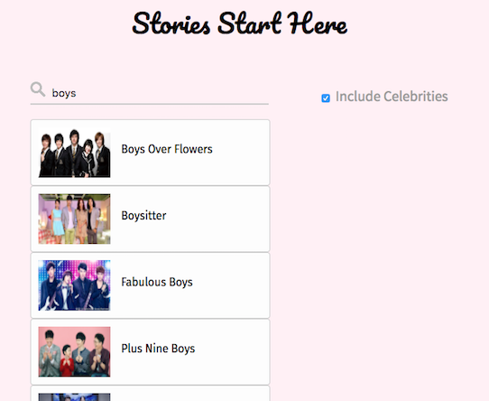
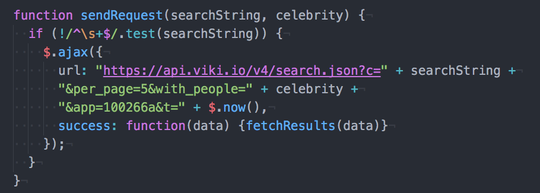

# StoryLine

[Story Line live][chrome]

[chrome]: http://google.com

StoryLine is an entertainment search engine focuses on television series.
It uses Viki API to retrieve the most popular videos from Korea, Taiwan, Japan
and China.

## Features & Implementation

### Search Engine

#### REST API
  An Ajax request is called upon search and returns an array of objects
  that contains titles, images, ids, etc.. Then they are made into lists
  and rendered.
  
#### Search Logic
  The API has a search string property that is used for matching. And a
  'include people' property that decides whether to include celebrity items.
## Future Directions for the Project

### User Preference
  Allowing users to setup accounts and save their favorite videos and
  share them on social media.
